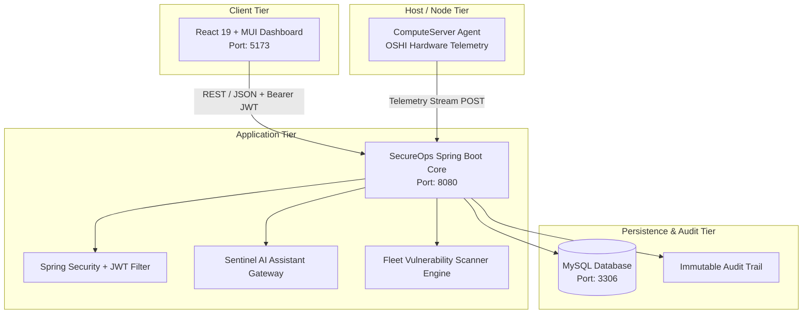

# 🛡️ Cloud Security Monitoring System with Incident Management (CSMS-IMA)
### *Next-Gen Enterprise Security Operations Center (SOC) & Infrastructure Observability Platform*

[](https://openjdk.org/)
[](https://spring.io/projects/spring-boot)
[](https://react.dev/)
[](https://vitejs.dev/)
[](https://mui.com/)
[](https://www.mysql.com/)
[](LICENSE)

---

## 📌 Executive Summary

**CSMS-IMA (Cloud Security Monitoring System with Incident Management & SecureOps)** is an enterprise-grade cloud security operations center (SOC) and real-time infrastructure observability platform. It empowers security engineers, DevOps administrators, and compliance auditors to monitor cloud and on-premise infrastructure, detect active cyber threats, triage security incidents, scan for Common Vulnerabilities and Exposures (CVEs), track compliance adherence (PCI DSS, SOC 2, ISO 27001), and orchestrate rapid incident responses.

The platform includes a dedicated lightweight **Host Monitoring Agent (`ComputeServer`)** that collects live system telemetry (CPU, RAM, Disk, Network, USB device connection events, software installation changes) using **OSHI** and streams them to the central backend.

---

## 🏗️ System Architecture

The platform operates on a multi-tier, event-driven security architecture:



### Component Breakdown
1. **Frontend (`CSM_Frontend`)**: High-performance Single Page Application built with React 19, Vite 8, Material UI 9, and Recharts. Features dark-themed cybersecurity aesthetics, responsive data visualization, and real-time KPI syncing.
2. **Backend Core (`CSM_Backend/SecureOps`)**: Spring Boot enterprise REST backend managing authentication, role-based access control (RBAC), incident life cycles, vulnerability tracking, audit logs, and compliance engines.
3. **Telemetry Agent (`ComputeServer`)**: Standalone, low-overhead Java daemon utilizing **OSHI (Operating System and Hardware Information)** to extract bare-metal and virtualized metrics (CPU load, RAM pressure, I/O rates, connected USB devices, registry changes) and stream them securely to the central SOC.
4. **Sentinel AI Copilot**: Integrated AI security analyst providing automated alert explanation, incident triage suggestions, and security query resolution.

---

## ✨ Key Features & Capabilities

### 1. 📊 Executive SOC Dashboard
- **100% Dynamic Telemetry**: Live metrics calculated straight from the database without hardcoded inflations.
- **Complete Asset Statuses**: Tracks all 4 asset health states (`HEALTHY`, `WARNING`, `CRITICAL`, `OFFLINE`).
- **Infrastructure Fleet Breakdown**: Categorizes monitored nodes into `Linux/Windows Servers`, `AWS EC2/Cloud`, `Microsoft Azure`, and `Kubernetes Pods`.
- **One-Click Trivy Fleet Scan**: Trigger real-time fleet vulnerability audits directly from the dashboard with instant toast feedback and audit logging.
- **Active Critical CVE Table**: Instant view of high-risk vulnerabilities (CVSS ≥ 9.0) with direct one-click patch actions.

### 2. 🖥️ Host Monitoring Agent (`ComputeServer`)
- Lightweight background process with embedded Tomcat disabled to minimize host footprint.
- Telemetry collection:
  - System CPU core loads & user ticks
  - Total and available Global Memory
  - Storage volume utilization across all mount points
  - Real-time Network bandwidth transmit/receive rates
  - **Peripheral Security**: Detects and alerts on unauthorized USB device insertions.
  - **Software Integrity**: Monitors installed applications and flags newly installed software.

### 3. 🚨 Security Incident Management (IR) & Alerts
- Full lifecycle incident management (Open, Investigating, Remediating, Resolved, Closed).
- Severity classification: `CRITICAL`, `HIGH`, `MEDIUM`, `LOW`.
- Mean Time to Resolution (MTTR) calculation and SLA breach monitoring.
- Real-time alert feed with severity filters and bulk resolution workflows.

### 4. 🔍 Vulnerability Management (CVEs)
- Centralized tracking of CVE identifiers, affected packages, and CVSS v3.1 scores.
- Status management: `DETECTED` vs `PATCHED`.
- Fleet remediation progress tracking and patch effectiveness verification.

### 5. 📜 Immutable Audit Logs & Compliance Reporting
- Cryptographically verifiable, append-only security audit trail recording all administrative actions, logins, status changes, and fleet scans.
- Pre-built compliance checks for **PCI DSS**, **SOC 2 Type II**, and **ISO/IEC 27001**.
- Exportable executive compliance reports.

### 6. 🤖 Sentinel AI Security Assistant
- Context-aware chatbot trained on security operations workflows.
- Answers infrastructure questions, suggests mitigation playbooks, and summarizes incidents.

### 7. 🔐 Git-Protected Sensitive Configuration
- Zero-exposure credential handling using runtime-decoded `ENC:...` Base64 wrappers and environment variable overrides (`${SPRING_DATASOURCE_PASSWORD}`, `${JWT_SECRET}`, `${SENTINEL_OPENCODE_API_KEY}`).

---

## 🛠️ Technology Stack

| Domain | Technology / Library | Version | Description |
|:---|:---|:---|:---|
| **Backend Core** | Java (OpenJDK) | 17 / 21+ | Core programming language |
| **Framework** | Spring Boot | 3.4.1 / 4.1.0 | Microservices & REST framework |
| **Security** | Spring Security & jjwt | 0.12.6 | Stateless JWT authentication & RBAC |
| **Data Access** | Spring Data JPA / Hibernate | 6.x | ORM & relational data access |
| **Database** | MySQL | 8.0+ | Primary relational storage |
| **Agent Telemetry** | OSHI (oshi-core) | 6.4.2 | Native hardware & OS metric extraction |
| **Frontend Core** | React | 19.2.7 | Declarative UI framework |
| **Build Tool** | Vite | 8.1.5 | Lightning-fast ESM bundler |
| **UI Components** | Material UI (@mui/material) | 9.3.1 | Enterprise styling and component system |
| **Icons** | Lucide React & MUI Icons | Latest | Modern vector iconography |
| **Data Visualization** | Recharts | 3.10.1 | Responsive charting (Pie, Area, Bar) |
| **Routing** | React Router DOM | 7.18.2 | Client-side routing |
| **HTTP Client** | Axios | 1.18.1 | Promise-based HTTP client with interceptors |

---

## 📂 Repository Structure

```
Cloud_Security_Monitoring_System/
├── CSM_Backend/
│   └── SecureOps/                    # Central Spring Boot Backend
│       ├── pom.xml                   # Maven dependencies and build configuration
│       ├── mvnw / mvnw.cmd           # Maven wrapper scripts
│       └── src/
│           ├── main/
│           │   ├── java/com/sentinel/security/
│           │   │   ├── config/       # SecurityConfig, DataInitializer, CorsConfig
│           │   │   ├── controller/   # 13 REST API controllers
│           │   │   ├── dto/          # Data Transfer Objects (e.g. SocDashboardDTO)
│           │   │   ├── model/        # JPA Entities (Asset, Alert, Incident, CVE, etc.)
│           │   │   ├── repo/         # Spring Data JPA Repositories
│           │   │   ├── security/     # JwtService, AuthFilter, UserDetails
│           │   │   └── service/      # Business logic services
│           │   └── resources/
│           │       └── application.properties # Server, database & secret properties
│           └── test/                 # Unit & integration test suites
│
├── CSM_Frontend/                     # React 19 + Vite Frontend SPA
│   ├── index.html                    # Root HTML document
│   ├── package.json                  # Dependencies & scripts
│   ├── vite.config.js                # Vite build settings
│   └── src/
│       ├── assets/                   # Static branding & images
│       ├── components/               # Navbar, Sidebar, ChatBot, AssetHealthCard, etc.
│       ├── pages/                    # DashboardPage, AssetsPage, IncidentsPage, etc.
│       ├── services/                 # Axios client (`api.js`) & API bindings
│       └── App.jsx                   # Main layout & router declarations
│
├── ComputeServer/                    # Standalone Host Telemetry Agent
│   ├── pom.xml                       # Agent dependencies (OSHI, Spring Boot)
│   ├── mvnw / mvnw.cmd               # Maven wrapper
│   └── src/main/java/com/assets/ComputeServer/
│       ├── ComputeServerApplication.java
│       ├── Model/                    # AgentConfig, TelemetryPayload
│       └── Service/                  # AgentTelemetryService (OSHI collectors)
│
├── CSM/                              # Project documentation & design decks
│   ├── Team4-CSMS-IMS.pptx          # Architecture and project presentation
│   └── View and design/             # Mockups, wireframes and UI designs
│
├── LICENSE                           # Project license (MIT)
└── README.md                         # Project documentation
```

---

## 🚀 Getting Started

### Prerequisites
Make sure the following tools are installed on your machine:
- **Java Development Kit (JDK)**: Version 17 or 21+ (`java -version`)
- **Node.js**: Version 20.x or higher (`node -v`) & **npm** (`npm -v`)
- **MySQL Server**: Version 8.0 or higher running on port `3306`
- **Git**

---

### Step 1: Database Setup
1. Start your local MySQL service.
2. The application is configured with `createDatabaseIfNotExist=true`. By default, it will automatically create and populate the database named **`CloudSecurity`**.
3. Verify your MySQL credentials match `application.properties` (Default: `root` / `root`). If your credentials differ, export them as environment variables (see [Environment Configuration](#-configuration--environment-variables)).

---

### Step 2: Run the Central Backend (`SecureOps`)
1. Open a terminal in the backend directory:
   ```bash
   cd CSM_Backend/SecureOps
   ```
2. Build and compile the backend:
   ```bash
   # Windows
   .\mvnw.cmd clean compile

   # Linux / macOS
   ./mvnw clean compile
   ```
3. Start the Spring Boot server:
   ```bash
   # Windows
   .\mvnw.cmd spring-boot:run

   # Linux / macOS
   ./mvnw spring-boot:run
   ```
4. The backend starts on: **`http://localhost:8080`**.
   - On initial startup, `DataInitializer` seeds the default administrator account.

---

### Step 3: Run the Frontend Application (`CSM_Frontend`)
1. Open a new terminal in the frontend directory:
   ```bash
   cd CSM_Frontend
   ```
2. Install dependencies:
   ```bash
   npm install
   ```
3. Start the Vite development server:
   ```bash
   npm run dev
   ```
4. Access the web interface in your browser:
   - **URL**: **`http://localhost:5173`**

---

### Step 4: (Optional) Run the Host Telemetry Agent (`ComputeServer`)
To stream real bare-metal / VM hardware metrics into your SOC:
1. Open a terminal in the agent directory:
   ```bash
   cd ComputeServer
   ```
2. Create a `config.json` file in the `ComputeServer` directory:
   ```json
   {
     "assetId": "<UUID-OF-AN-ASSET-IN-YOUR-DATABASE>",
     "serverUrl": "http://localhost:8080",
     "intervalSeconds": 10
   }
   ```
3. Start the agent:
   ```bash
   # Windows
   .\mvnw.cmd spring-boot:run

   # Linux / macOS
   ./mvnw spring-boot:run
   ```
4. The agent will begin streaming live CPU, memory, disk, network, and hardware events to the central backend every 10 seconds.

---

## 🔑 Default Credentials

The platform is pre-seeded with an initial administrator account for immediate local evaluation:

| Parameter | Value |
|:---|:---|
| **Role** | Super Administrator (`ADMIN`) |
| **Username** | `admin` |
| **Default Password** | `Admin@123` |
| **Default Email** | `admin@sentinel.com` |

> *Tip: You can register additional standard users through the registration page (`/register`). Non-admin users can request role elevations through the "Requests" panel.*

---

## ⚙️ Configuration & Environment Variables

All parameters in [application.properties](CSM_Backend/SecureOps/src/main/resources/application.properties) support environment variable overrides:

| Property | Environment Variable | Default Value | Description |
|:---|:---|:---|:---|
| `spring.datasource.url` | `SPRING_DATASOURCE_URL` | `jdbc:mysql://localhost:3306/CloudSecurity?...` | MySQL connection string |
| `spring.datasource.username` | `SPRING_DATASOURCE_USERNAME` | `root` | MySQL username |
| `spring.datasource.password` | `SPRING_DATASOURCE_PASSWORD` | `root` | MySQL password |
| `jwt.secret` | `JWT_SECRET` | `ENC:c2VudGluZWwtc2VjdXJ...` | Base64-safe secret for signing JWTs |
| `jwt.expiration` | `JWT_EXPIRATION` | `86400000` (24h) | JWT validity duration in ms |
| `sentinelcore.ai.opencode.api-key` | `SENTINEL_OPENCODE_API_KEY` | `ENC:c2stNzU0YjIyOT...` | Base64-safe OpenCode API key for Sentinel AI |
| `sentinelcore.ai.opencode.endpoint`| `SENTINEL_OPENCODE_ENDPOINT` | `http://localhost:20128/v1/chat/completions` | AI model endpoint |

---

## 📡 Core API Reference

The backend exposes authenticated REST endpoints secured via HTTP Bearer JWT:

### 🔐 Authentication (`/api/auth`)
- `POST /api/auth/login`: Authenticate with username & password; returns JWT token.
- `POST /api/auth/register`: Register a new operator account.
- `GET  /api/auth/me`: Retrieve currently authenticated user profile.

### 📊 SOC Dashboard (`/api/dashboard`)
- `GET  /api/dashboard/soc-metrics`: Complete consolidated SOC dashboard summary.
- `GET  /api/dashboard/auditLogs-summary`: Recent fleet security audit events.

### 🖥️ Asset Management (`/api/assets`)
- `GET    /api/assets`: List all tracked cloud & on-premise infrastructure assets.
- `POST   /api/assets`: Provision a new asset (`HEALTHY`, `WARNING`, `CRITICAL`, `OFFLINE`).
- `GET    /api/assets/{id}`: Detailed asset inspection & hardware specifications.
- `DELETE /api/assets/{id}`: Decommission asset from fleet monitoring.

### 🚨 Incident Management (`/api/incidents`)
- `GET  /api/incidents`: Fetch active security incidents.
- `GET  /api/incidents/critical`: Filter critical priority incidents.
- `GET  /api/incidents/stats`: Summary counts (open, investigating, resolved, MTTR).
- `POST /api/incidents/{id}/resolve`: Mark security incident as resolved.

### 🔍 Vulnerabilities & Trivy Scanner (`/api/v1/vulnerabilities` & `/api/vulnerabilities`)
- `GET  /api/vulnerabilities`: List tracked CVE vulnerabilities with CVSS scores.
- `GET  /api/vulnerabilities/critical`: List high-priority unpatched CVEs.
- `POST /api/vulnerabilities/scan/trivy`: Execute fleet-wide Trivy vulnerability scan.
- `POST /api/vulnerabilities/{id}/patch`: Mark CVE as patched and remediated.

### 📈 Hardware Telemetry & Ingestion (`/api/agent/telemetry` & `/api/metrics`)
- `POST /api/agent/telemetry`: Ingest OSHI telemetry payload from `ComputeServer` agent.
- `GET  /api/metrics/fleet-average`: Aggregate CPU, RAM, Disk, and Network utilization.

### 📜 Compliance & Audit (`/api/compliance`)
- `GET  /api/compliance/summary`: PCI DSS, SOC 2, and ISO 27001 scorecards.
- `GET  /api/compliance/audit-logs`: Immutable system audit log trail.

### 🤖 Sentinel AI Copilot (`/api/chat`)
- `POST /api/chat`: Send prompt to AI security analyst and stream intelligent response.

---

## 🔒 Security Best Practices Implemented

1. **Stateless Authentication**: Pure JWT token-based authentication with expiration controls and client-side storage cleanup on 401s.
2. **Git-Safe Secret Storage**: All API keys and JWT signing secrets use `ENC:` prefixes with automatic Base64 runtime decoding, ensuring that secrets never trigger Git credential scanners.
3. **Role-Based Access Control (RBAC)**: Method-level security (`@EnableMethodSecurity`, `@PreAuthorize`) protecting administrative endpoints.
4. **Audit Trail Immutability**: All sensitive configuration updates, user promotions, and scan triggers generate timestamped entries in the audit repository.

---

## 🤝 Contributing

1. Fork the repository.
2. Create a feature branch: `git checkout -b feature/AmazingSecurityFeature`
3. Commit your changes: `git commit -m 'Add AmazingSecurityFeature'`
4. Push to the branch: `git push origin feature/AmazingSecurityFeature`
5. Open a Pull Request.

---

## 📄 License

This project is licensed under the MIT License — see the [LICENSE](LICENSE) file for details.
